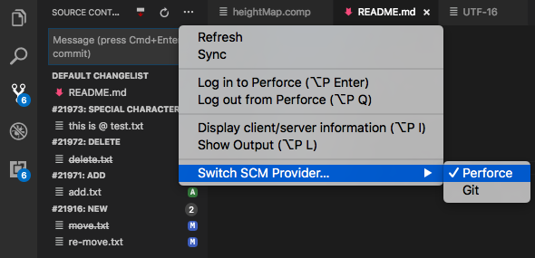

# vscode-perforce

  
  

Perforce integration for Visual Studio Code

## Commands

* `add` - Open a new file to add it to the depot
* `edit` - Open an existing file for edit
* `revert` - Discard changes from an opened file
* `diff` - Display diff of client file with depot file
* `diff revision` - Display diff of client file with depot file at a specific revision
* `info` - Display client/server information
* `login`, `logout` - Login operations

## Configuration

|Name|Type|Description|
|---|---|---|
|`perforce.editOnFileSave`|`boolean`|Automatically open a file for edit when saved|
|`perforce.editOnFileModified`|`boolean`|Automatically open a file for edit when Modified|
|`perforce.addOnFileCreate`|`boolean`|Automatically Add a file to depot when Created|
|`perforce.deleteOnFileDelete`|`boolean`|Automatically delete a file from depot when deleted|
|`perforce.command`|`string`|Configure a path to p4 or an alternate command if needed|
|`perforce.compatibilityMode`|`string`|Specify if we should run in compatibility mode, currently support `perforce` and `sourcedepot`|
|`perforce.maxBuffer`|`number`|Specify the largest amount of data allowed for commands, including file comparison. Default is 204800 (200KB)|
|`perforce.realpath`|`boolean`|**Experimental** Try to resolve real file path before executing command|

## Status bar icons

*  opened in add or edit
*  not opened on this client
*  not under client's root

## Source Control in VS Code

  

Visual Studio Code now allow to choose which [Source Control Manager](https://code.visualstudio.com/docs/extensionAPI/api-scm) to use.  
* You can find `Switch SCM Provider` in the command palette, or in the Source Control section menu
* Use the input box to create new changelists
* Right-click on file and changelist for more commands

  
Keep in mind this is still in early beta! Explore and leave your comments on [GitHub](https://github.com/stef-levesque/vscode-hexdump/issues)

## Installation

1. Install *Visual Studio Code* (1.11.1 or higher)
2. Launch *Code*
3. From the command palette `ctrl+shift+p` (Windows, Linux) or `cmd+shift+p` (OS X)
4. Select `Install Extensions`
5. Choose the extension `Perforce for VS Code`
6. Reload *Visual Studio Code*

## Contributing

1. Fork it!
2. Create your feature branch: `git checkout -b my-new-feature`
3. Commit your changes: `git commit -am 'Add some feature'`
4. Push to the branch: `git push origin my-new-feature`
5. Submit a pull request :D

## Requirements

Visual Studio Code v1.11.1

## Credits

* [Visual Studio Code](https://code.visualstudio.com/)
* [vscode-docs on GitHub](https://github.com/Microsoft/vscode-docs)

## License

[MIT](LICENSE.md)
